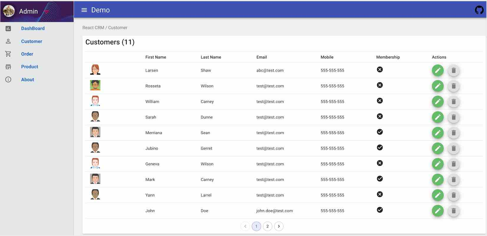

# React Redux CRM

### Features

- This project is built on the top of React/Redux.
- The UI component are mainly built on Material-UI.
- This project uses Redux-Thunk to support back-end API.
- The backend API is just readonly dump service.
- Use Formik to manage the form submission
- Integrate with storybook for react.
- The project is built on TypeScript 3.x
- Use Formsy to manage form submission~
- To simulate real-world business, this starter project chooses Json-Server as fake Restful API. (You can simple replace it with your own API)

### Screenshots




## Build Setup

```bash
# Clone project
git clone https://github.com/bhattrahul007/mui-crm.git


# install the packages with npm
cd mui-crm
npm install

# start the server with hot reload at localhost:4000
npm start
# or yarn
yarn start

# Storybook
## Start storybook
npm run storybook
## Build storybook
npm run build-storybook

## build for production
npm run build

```


## Welcome to fork or clone

For detailed explanation on how things work, checkout following links please.

- [React](https://facebook.github.io/react/)
- [Redux](http://redux.js.org/)
- [Material-UI](http://www.material-ui.com/)
